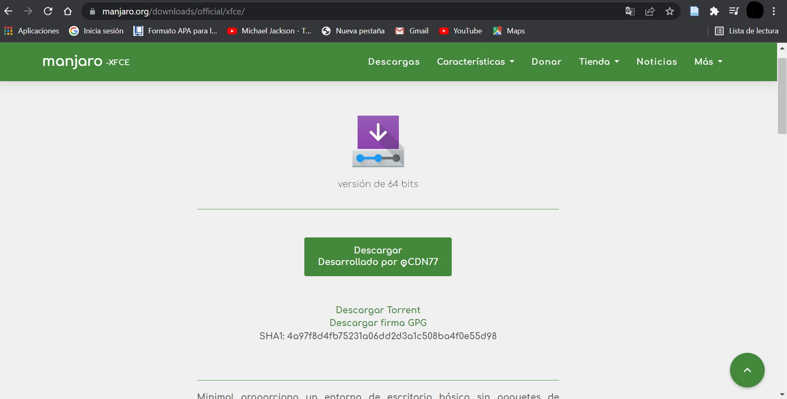
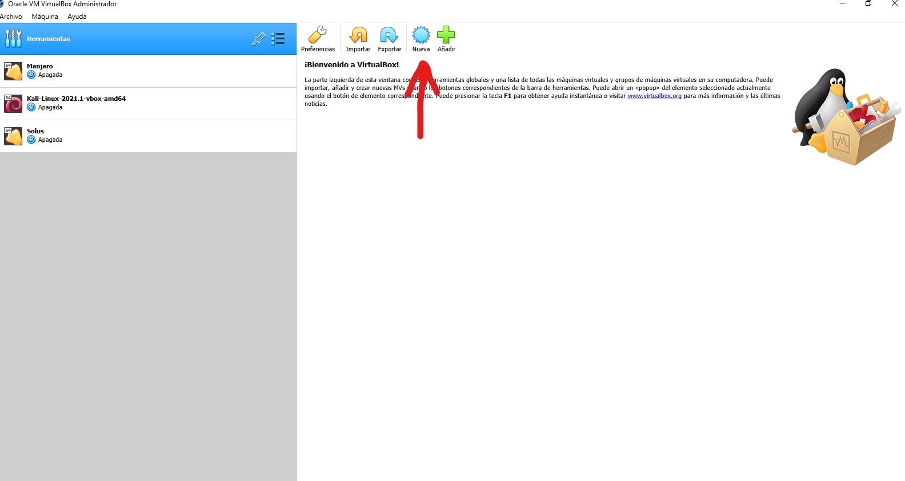

# MANJARO

Manjaro es una distribución bastante conocida.
Basada en Arch Linux, también es de lanzamiento continuo (rolling release), 
pero al contrario del sistema del que deriva, Manjaro es muy amigable con el usuario, 
tanto, que recién instalada ya trae todo lo necesario para empezar a usar Steam.
 
 # Instalacion
instalacion paso a paso de manjaro.

## 1. Descarga
Descargamos la imagen iso del SO [Manjaro][1_0] que pesa aproximadamente 3.4 Gb

[1_0]:https://manjaro.org/downloads/official/xfce/ 

## 2. Maquina Virtual
Para poder instalar nuestro SO vamos a hacer uso la maquina virtual [VirtualBox][1_1]
ya que por medio de esta podemos crear un SO sobre un SO y procedemos a crear nuestra maquina virtual.

## 2.1 crear una nueva maquina virtual
Para crear una nueva maquina virtual abrimos nuestro [VirtualBox][1_1] y en la parte superior nos saldra la opcion
para lograr nuestro cometido 

## 2.2 nomre y ubicacion del SO
Organizar en que carpeta desea ubicar la maquina virtual, lo cual por defecto viene 
en una 

[1_1]:https://www.virtualbox.org/