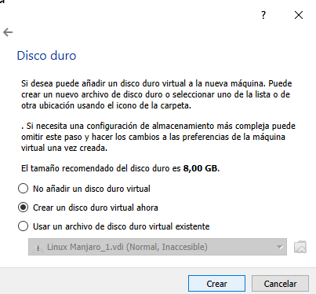

# MANJARO

Manjaro es una distribución bastante conocida.
Basada en Arch Linux, también es de lanzamiento continuo (rolling release), 
pero al contrario del sistema del que deriva, Manjaro es muy amigable con el usuario, 
tanto, que recién instalada ya trae todo lo necesario para empezar a usar Steam.
 
 ## Instalacion
instalacion paso a paso de manjaro.

# 1. Descarga
Descargamos la imagen iso del SO [Manjaro][1_0] que pesa aproximadamente 3.4 Gb

[1_0]:https://manjaro.org/downloads/official/xfce/ 

# 2. Maquina Virtual
En esta instalacion la vamos a hacer por medio de [VirtualBox][1_1] ya que vamos a 
instalar el SO como una maquina virtual, por lo tanto, a continuacion crearemos una
maquina virtual.

## 2.1 crear una nueva maquina virtual
para empezar  

[1_1]:https://www.virtualbox.org/

