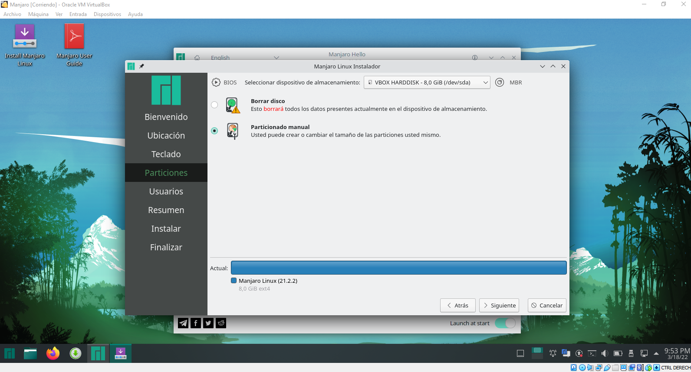
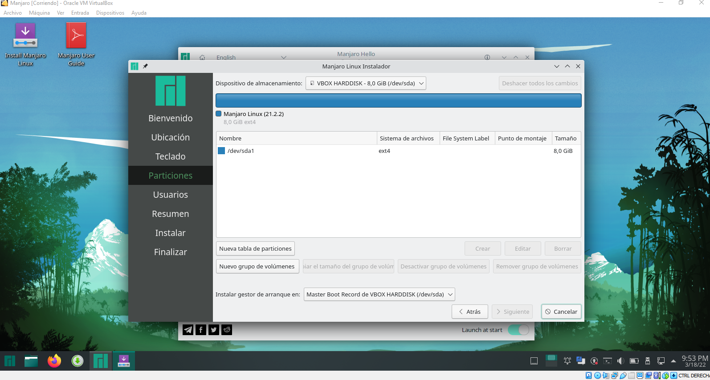

# MANJARO
Manjaro es una distribución bastante conocida; desarrollado en Australia, Francia y Alemania, Basada en Arch Linux, también es de lanzamiento continuo (rolling release), pero al contrario del sistema del que deriva, Manjaro es muy amigable con el usuario, tanto, que recién instalada ya trae todo lo necesario para empezar a usar Steam.

## Empresa Encargada
La persona encargada de la revisión de esta SO en sus inicios, fue Jesse Smith de DistroWatch, la realizó en enero de 2013 a Manjaro Linux 0.8.3, lo cual destacó que "Manjaro realiza todo de manera rápida. El sistema es ligero y el escritorio Xfce es muy fluido. La distribución fue diseñada con la idea de estar lista para usar tanto como sea posible".

## Entorno De Escritorio
La versión 0.8.7 contenía los siguientes entornos de escritorio soportados de manera oficial: XFCE (principal), y OpenBox. Las ediciones comunitarias incluyen: E17, MATE, LXDE, Cinnamon/Gnome-shell, KDE/Razor-qt y Fluxbox. La versión NET-Edition estaba disponible para quienes deseen instalar sus propios entornos de escritorio.

## Explorador De Archivos 
Donnatella está programado en GTK+3 y es muy bien optimizado, por lo que su consumo es bastante reducido y es ideal para funcionar con cualquier tipo de escritorio grafico sin que ello suponga una fuerte repercusión sobre el rendimiento general de Manjaro.

### Características:
* Interfaz sencilla de comprender y utilizar.

* Utiliza las reglas de Vim, por lo que los usuarios experimentados en este software tendrán cierta ventaja al utilizarlo.

* Posibilidad de establecer marcas de ubicación.

* Potente herramienta de búsqueda para localizar archivos en nuestros discos duros.

* Posibilidad de establecer varias carpetas por defecto al inicio de la aplicación.

## Gestor De Paquetes
Teniendo en cuenta que Manjaro es una distribución basada en Arch Linux, estas comparten unas características como el gestor de paquetes Pacman.

## Lanzamiento 
Lanzamiento de la primera versión de Linux manjaro la cual fue la versión 0.8.0 “Ascella” en 20-07-2011, a medida de los años hasta el momento han lanzado aproximadamente 35 versiones de esta distribución, siendo la última versión la 21.2.2 “Qonos” en 23-01-2022. La versión 0.8.7 contenía los siguientes entornos de escritorio soportados de manera oficial: XFCE (principal), y OpenBox.4.

Las ediciones comunitarias incluyen: E17, MATE, LXDE, Cinnamon/Gnome-shell, KDE/Razor-qt y Fluxbox. La versión NET-Edition estaba disponible para quienes deseen instalar sus propios entornos de escritorio.

# Instalación
Instalación paso a paso de manjaro.

## 1. Descarga
Descargamos la imagen iso del SO [Manjaro][1_0] que pesa aproximadamente 3.4 Gb

[1_0]:https://manjaro.org/downloads/official/xfce/ 

## 2. Máquina Virtual
Para poder instalar nuestro SO vamos a hacer uso la máquina virtual [VirtualBox][1_1] ya que por medio de esta podemos crear un SO sobre un SO y procedemos a crear nuestra máquina virtual.

[1_1]:https://www.virtualbox.org/

## 2.1. Crear una nueva máquina virtual
Para crear una nueva máquina virtual abrimos nuestro [VirtualBox][1_2] y en la parte superior nos saldrá la opción para lograr nuestro cometido.

[1_2]:https://www.virtualbox.org/

## 2.2. Nombre y ubicación del SO
Organizar en que carpeta desea ubicar la máquina virtual, lo cual por defecto viene en una carpeta del mismo software.

Luego de esto presionar "Next".

## 2.3. Tamaño de memoria
Ahora nos aparece una ventana en la cual tenemos que asignar la cantidad de Memoria RAM le asignaremos a nuestra máquina virtual, nos aparece una barra o una casilla para poder poner exactamente la cantidad; hay que tener en cuenta que no podemos exagerar ni asignar poca Memoria RAM puesto que si no está en un punto equilibrado puede ponerse lento o nuestra máquina virtual en ejecución o SO que tengamos originalmente en nuestro equipo por ello es recomendable no sobrepasar el límite que nos plantea la misma máquina virtual.

## 2.4. Disco Duro
Nuestra máquina virtual necesita un disco duro en el que almacenara toda la información que manejaremos ahí. En esta pestaña nos da tres opciones, la primera nos la da para no añadir un disco duro, la segunda es para crear un disco duro virtual y así guardar información, la tercera y última opción es por si de pronto tenemos un archivo que anteriormente por ejemplo hayamos utilizado como disco duro de otra máquina virtual y lo utilizaríamos en la que estamos creando; en este caso le daremos en la segunda opción porque crearemos una nuevo.

## 2.5. Tipo de archivo de disco duro
* [VDI (VirtualBox Disk Image)][2.5.1]: es la selección por defecto, es la imagen de un disco duro  virtual o el disco lógico asociado con una máquina virtual.

* [VHD (Virtual Hard Disk)][2.5.2]: es la opción a elegir si lo que queremos es crear un disco virtual
versátil, que podamos recuperar cualquier archivo en su interior fácilmente. Se podrá utilizar   como unidad de almacenamiento habitual y soporta particiones de todo tipo, como cualquier otro disco duro, además de varios usuarios por cada SO virtual instalado en él. Se utiliza sobre todo para Microsoft Virtual PC.

* [VMDK (VirtualBox Machine Disk)][2.5.2] es el formato típico de VMWare (otro software de virtualización, semejante a VirtualBox). Se escogerá esta opción para contar con plena compatibilidad entre VMWare y VirtualBox y poder pasar sistemas operativos virtuales entre ambos softwares sin mayor problema.

En nuestro caso marcaremos la primera opción VDI y presionaremos siguiente.

[2.5.1]:https://www.techopedia.com/definition/10933/virtual-disk-image-vdi

[2.5.2]:https://megazona.com/software/tipos-de-archivo-de-disco-duro-virtual-en-virtualbox

## 2.6. Almacenamiento de unidad física del disco duro
En este punto nos pide seleccionar si queremos nuestro disco duro <b>reservado dinámicamente </b> que solo se usara espacio en el disco físico a medida que se llena (hasta un máximo tamaño fijo), sin embargo, no se reducirá de nuevo automáticamente cuando el espacio en él se libere o el <b>Tamaño fijo</b> que puede tomar más tiempo para su creación en algunos sistemas, pero normalmente es más rápido al usarlo.

En nuestro caso utilizaremos la opción 1 puesto que queremos una cantidad específica para nuestro SO.

## 2.7. Ubicación del archivo y tamaño
En este paso ya prácticamente hemos configurado la parte de almacenamiento en nuestro disco, ahora solamente falta asignar la cantidad de almacenamiento que queremos que este tenga y posterior a ello la ubicación de donde se encontrará ese archivo.

Seleccionamos la opción crear para crear nuestra máquina virtual. 

# 3. Configuraciones
Una vez creada la máquina virtual, accedemos a las configuraciones de la misma para poder cargar nuestra imagen iso que descargamos inicialmente; a continuación, mostraremos el paso a paso de la carga de la imagen iso.

## 3.1. Almacenamiento
En las configuraciones siempre nos salen opciones para poder modificar algo que de pronto nos haga falta.

En esta ventana nos vamos al apartado de almacenamiento porque aquí es donde vamos a cargar la imagen iso en una unidad de disco que se crea al momento de hacer el proceso del disco duro.

## 3.2. Selección del disco
Se selecciona el disco en la cual cargaremos la imagen.

## 3.3. Búsqueda
Seleccionamos en nuestros archivos la ubicación de nuestra imagen iso y la seleccionamos.

Posteriormente le damos en "aceptar" para confirmar nuestra configuración.

## 3.4. Crear
En este caso se necesita crear otra unidad para, así que para crearla se necesita hacer lo siguiente
le damos en el controlador IDE y en el icono de disco duro.

Luego de eso, si se tiene la unidad ya creada, se selecciona, si no se debe crear con el icono que sale allí y seguir los mismos pasos desde el punto <b>2.4</b> de este tutorial.

y para finalizarlo, así quedaría el otro disco creado, en el mismos controlador IDE

# 4. Ejecutar SO
En este punto ya hemos creado y configurado nuestra máquina virtual con el SO Manjaro, lo que sigue a continuación es la ejecución de la máquina para ver si fue correctamente creada.

y si es así, se abrirá un menú en la cual nos da las siguientes opciones.

Seleccionaremos la opción "Boot with open source drivers", en este momento nos damos cuenta que nuestro SO fue cargado con éxito, y procedemos a seleccionar esta opción para poder tener la distribución completa puesto que Linux es un SO libre.

Posterior a esto saldrá la siguiente ventana que nos da una bienvenida al SO Manjaro.

## 4.1. Configuración Manjaro
Luego de esto procedemos a hacer las configuraciones básicas que tenemos que hacer 
para tener una buena experiencia en el SO.

Inicialmente se nos va a desplegar una ventana en al que esta el paso a paso de las configuraciones;

* Iniciamos configurando el origen del equipo.

* Luego seleccionamos el idioma del teclado para utilizar

## 4.1.1. Particiones de disco
En la siguiente ventana se presentan 2 opciones, la primera es borrar el disco, básicamente porque recién está instalando el SO y la otra es la opción de conservar la información y realizar particiones, en nuestro caso, escogeríamos la segunda, ya que necesitamos modificarlo.

Procedemos a hacer las particiones necesarias que cada usuario necesita en este caso hare 2 particiones en el primer disco y una sola en el segundo.

Aquí nos muestra los Discos que tenemos con posibilidad de modificarlo.

Primero modificaremos el disco 1, lo seleccionamos y le damos borrar para hacer las particiones desde cero.

Luego quedara disponible para modificación toda la unidad, la seleccionamos y le damos crear para hacer la primera partición.

Aquí hay que tener algo en cuenta, y es que en la primera partición se le pone de tamaño la misma cantidad de megas que se puso de memoria RAM al inicio de la instalación, luego cambiamos la opción en sistemas de archivos y lo ponemos en <b>"linuxswap"</b>.

	
Asignamos el tamaño que queda en la otra partición para el disco, pero aquí hacemos una modificación ponemos el sistema de archivos en ext4 y le ponemos como punto de anclaje el <b>root ( / )</b> que en este y le damos siguiente.

Como en este caso tenemos 2 discos, nos falta modificar el segundo disco y hacemos lo mismo que con el anterior solo le dejamos todo el tamaño ya que solo será una partición, y en el punto de anclase le ponemos <b>/home</b> el cual será el almacenamiento de nuestros archivos <b>(en este ejercicio)</b>

Para finalizar el área de particiones le damos siguiente (ok).

Siguiendo con la configuración, nos muestra los datos del usuario, para seguir llenamos las correspondientes casillas.

Para casi terminar la configuración de Manjaro, nos muestra un resumen de las configuraciones
anteriores que hicimos.

Para terminar, le damos en el botón <b>instalar</b> para comenzar el proceso de instalación.

Para finalizar, así estaría el desktop de Manjaro listo para utilizarse.

## Mas recursos
* [About Manjaro][3.1]
* [Manjaro Linux][3.2]
* [Donnatella][3.3]

[3.1]:https://wiki.manjaro.org/index.php/About_Manjaro

[3.2]:https://es.wikipedia.org/wiki/Manjaro_Linux

[3.3]:https://www.softzone.es/2014/02/18/donnatella-un-completo-gestor-de-archivos-para-arch-linux/

# Tutorial hecho por:
* Diego Marcelo Jimenez Melendez.
* Jhon Fabio España Cortes.
* Errol Vladimir Garcia Silva.

Universidad De Nariño
